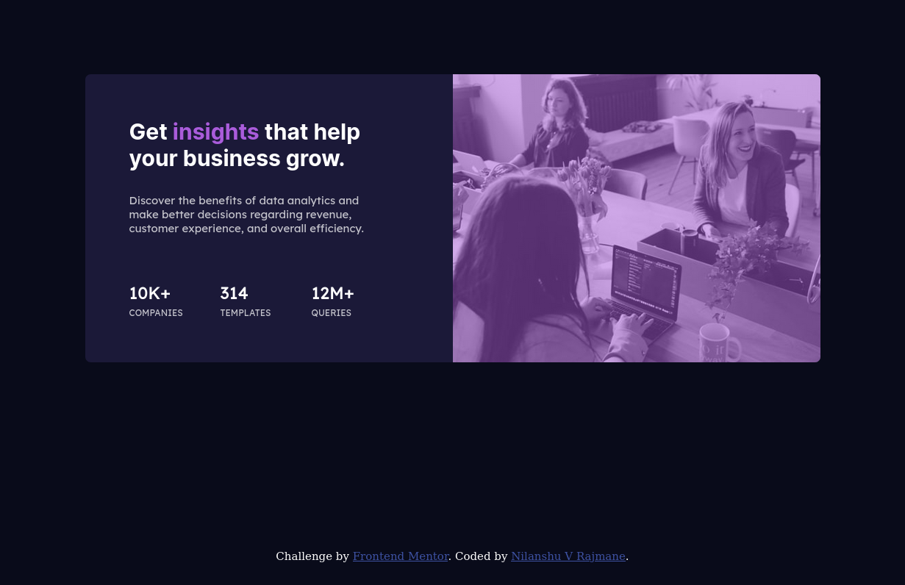

# Frontend Mentor - Stats preview card component solution

This is a solution to the [Stats preview card component challenge on Frontend Mentor](https://www.frontendmentor.io/challenges/stats-preview-card-component-8JqbgoU62). Frontend Mentor challenges help you improve your coding skills by building realistic projects. 

## Table of contents

- [Overview](#overview)
  - [The challenge](#the-challenge)
  - [Screenshot](#screenshot)
  - [Links](#links)
- [My process](#my-process)
  - [Built with](#built-with)
  - [What I learned](#what-i-learned)
  - [Continued development](#continued-development)
  - [Useful resources](#useful-resources)
- [Author](#author)
- [Acknowledgments](#acknowledgments)

**Note: Delete this note and update the table of contents based on what sections you keep.**

## Overview

### The challenge

Users should be able to:

- View the optimal layout depending on their device's screen size

### Screenshot

### Links

- Solution URL: [Github](https://github.com/nilanshu96/stats-preview-card-component)
- Live Site URL: [Live Site](https://nilanshu96.github.io/stats-preview-card-component/)

## My process

### Built with

- Semantic HTML5 markup
- CSS custom properties
- Flexbox
- CSS Grid
- Mobile-first workflow

### What I learned

I learnt working with css grid and flexbox. Most importantly I've learnt what is flex-basis (although it isn't in the solution) and using grid-template-columns and grid-template-rows correctly. Also background images can overflow from a container and it's necessary to do a overflow:hidden to show the border-radius.

### Continued development

I'll be working to master flex and grid layout as I still am taking a lot of time to come with solutions

### Useful resources

- [StackOverflow answer](https://stackoverflow.com/questions/25066214/flexbox-not-giving-equal-width-to-elements) - This helped me understand the correct meaning of flex basis

## Author

- Website - [Nilanshu V Rajmane](https://github.com/nilanshu96)
- Frontend Mentor - [@yourusername](https://www.frontendmentor.io/profile/nilanshu96)
- Twitter - [@yourusername](https://www.twitter.com/nilanshu96)